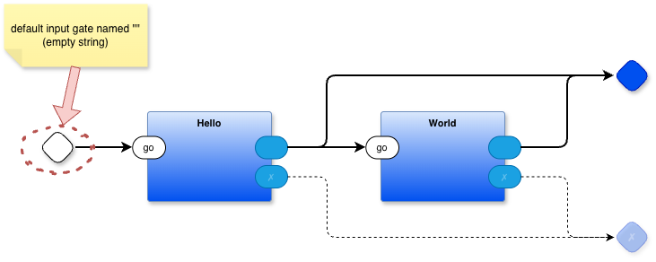

```
ifndef PBP_ROOT
$(error PBP_ROOT environment variable is not set)
endif

all:
	node ./pbp/das/das2json.mjs seq.drawio
	python3 main.py . '' main seq.drawio.json

init:
	${PBP_ROOT}/init.bash
```

replace `seq` in `seq.drawio` and `seq.drawio.json` with your drawing's name.

If your project needs a command line argument, replace `''` with the argument (in single quotes). This argument is passed into the "" input gate (rhombus) of the top-most diagram (`seq` in this example, or whatever you renamed it to).
