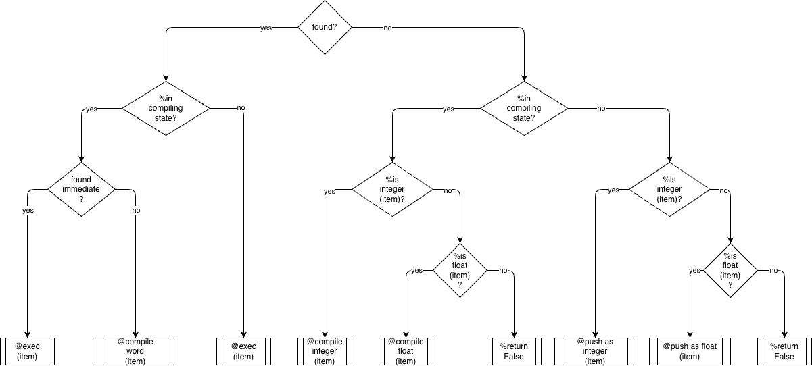
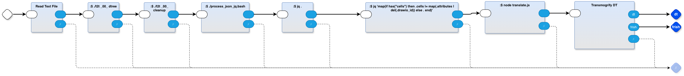

# dtree

Transpil/compile/transmogrify the following decision tree diagram to executable code



For example

`diagram -> JSON -> Python`

(in fact, the code in this directory, as it stands, does `diagram -> JSON -> out.frish`)

## Usage
`make`
output is in `out.frish`
intermediate form is in `out.dt`


`.frish` is a meta-language that is like Python, but uses `{}` instead of indentation

`.dt` is an intermediate representation that is used by this transmogrifier, the final output is in the `.frish` file, but, we save out the `.dt` code to show the stages of this transmogrifier.

## How
The top level source code is a diagram viewed using the [drawio](drawio.com) editor. `dtree-transmogrifier.drawio`

1. The diagram is converted to `.json` using `pbp/das/das2json.mjs` 
2. The `.json` is converted to `.dt` using the front end of the code in the `dtree-transmogrifier.drawio` using `.bash`, `nodejs` and `jq`
3. The final stage in the diagram, `Transmogrify DT`, uses `t2t` (text-to-text transpilation, employing [OhmJS](ohmjs.org) and [RWR](https://github.com/guitarvydas/pbp-dev/blob/dev/t2t/doc/rwr/RWR%20Spec.pdf) to convert the `.dt` code to `.frish` using the grammar `dt.ohm` and the RWR rules `dtfrish.rwr`. As a spin-off, we send the same `.dt` code through `dtpretty.rwr` to indent the `.dt` intermediate form in a way that is more human readable. This spin-off uses the same grammar `dt.ohm`.

1. conversion to JSON (in Makefile)
`node $(PBP)/das/das2json.mjs dtree-transmogrifier.drawio`

2. Conversion to `.dt` internal form consists of the first 7 stages in the  plus the first stage (`swipl tree_walk.pl`) of . The `swipl tree_walk.pl` invokes Prolog (SWIPL) to inference some facts about the diagram (which arrows are connected to which boxes on the diagram). This part _could_ have been written in Python or Javascript using loops with loops, but, it was easier to write the inferencing code using SWIPL syntax.

3 . The final conversion of the `.dt` code is done in  `:$ t2t2 _00_ dt dtfrish`. This simply invokes the pbp/t2t.bash script (from the `./t2t2` bash script) and provides the placeholder for the `pbp/` directory (`_00_`), the name of the grammar file `dt.ohm` and the name of the rewrite rules file `dtfrish.rwr`. This is followed by a simple indenter to make the generated code more human readable. In parallel, the spin-off uses `dt.ohm` and `dtpretty.rwr` to indent the intermediate `dt` code for human consumption (this is only for purposes of inspecting the intermediate code - the transmogrifier doesn't need the code to be indented and, it uses the intermediate form to generate the `out.frish` file, which is the actual result).


We are using as many pre-existing tools as possible. Today's parsing libraries want to parse code in text form. To be able to use these libraries, we use a pipeline to convert the `.drawio` code to pure text, devoid of the huge amount of graphics-rendering information present in the `.drawio` file.


## Intermediate Representation
The diagram is converted to the following intermediate text.
```
[ found 
    | yes: [ %incompilingstate 
        | yes: [ foundimmediate 
            | yes: @exec(item) 
        
            | no: @compileword(item) 
        ]
    
        | no: @exec(item) 
    ]

    | no: [ %incompilingstate 
        | yes: [ %isinteger(item) 
            | yes: @compileinteger(item) 
        
            | no: [ %isfloat(item) 
                | yes: @compilefloat(item) 
            
                | no: %return False 
            ]
        ]
    
        | no: [ %isinteger(item) 
            | yes: @push as integer(item) 
        
            | no: [ %isfloat(item) 
                | yes: @push as float(item) 
            
                | no: %return False 
            ]
        ]
    ]
]
```

## Final `.frish` Output
The above `.dt` code is converted to the following `.frish` code
```
if (found) {
    if (%incompilingstate) {
        if (foundimmediate) {
            %funcall exec(item)
        } else {
            %funcall compileword(item)
        }
    } else {
        %funcall exec(item)
    }
} else {
    if (%incompilingstate) {
        if (%isinteger(item)) {
            %funcall compileinteger(item)
        } else {
            if (%isfloat(item)) {
                %funcall compilefloat(item)
            } else {
                %returnFalse
            }
        }
    } else {
        if (%isinteger(item)) {
            %funcall pushasinteger(item)
        } else {
            if (%isfloat(item)) {
                %funcall pushasfloat(item)
            } else {
                %returnFalse
            }
        }
    }
}
```

This generated code is meant to be automatically include (using M4 or some other includer program written in Python or JS) or manually copy/pasted into the code for the parent project.

The generated code is not the complete code for a whole project, but, only part of the project. The idea is that - in some places - we want to draw diagrams of our logic, convert the diagrams to code, then paste the code into our project.

[aside: the test case that this was used on was the `frishc` project which expects to convert a source file containing `.frish` code into Python. This test case is not included here, since we are only interested in converting the decision tree diagram, here].


# Porting to Other Languages and Projects
1. Draw a diagram, like that in `xinterpret.drawio` using [drawio](drawio.com).
2. Create a new rewrite rules file, based on (copied and hacked-on) `dtfrish.rwr`.
3. Change the name of the part `:$ t2t2 _00_ dt dtfrish` to use the rewrite rules created in step 2. For example, if you created `dtxyz.rwr`, then change the name of the part to `:$ t2t2 _00_ dt dtxyz`
4. Change the output gate (blue rhombus) name from `frish` to the file extension of your choice, e.g. something like `js`, `py`, etc.
5. Run `make`
6. Copy `out.<extension>` to your parent project and paste it into your code. 

If you know how to use `M4`, you can use it to include the code automatically, or you can write a little includer program in the language of your choice.  The M4 syntax for including `xinterpret.frish` is 
```
include(`xinterpret.frish')
```
and you need to run `M4` with input redirected from your source filename that has the include, and redirect stdout to the final version of the source file.