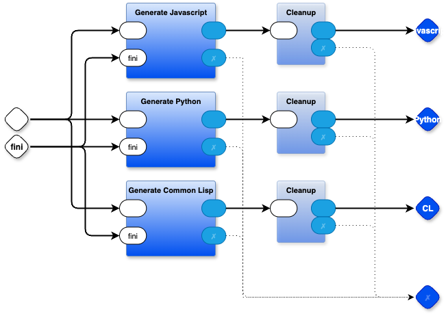

# Generate 0D Kernel

- source code for the kernel is written in `.rt` format (similar to Python, but with braces instead of indentation)
- generates a kernel in Python, in Javascript and in Common Lisp
- source code is written in `kernel.drawio` (Containers) and `*.rt` (Leaves)

# Usage:

## command line
make

# Notes

`:$ cmd arg1 arg2 ...` is a shell-out
`:?xyz` is a probe with name "xyz"
`:sss` is a string `sss`

I removed the special case code for handling shell-outs in the kernel and replaced it with a part. See [kernel_external.rt](https://github.com/guitarvydas/pbp-dev/blob/dev/kernel/kernel_external.rt) for implementation details

